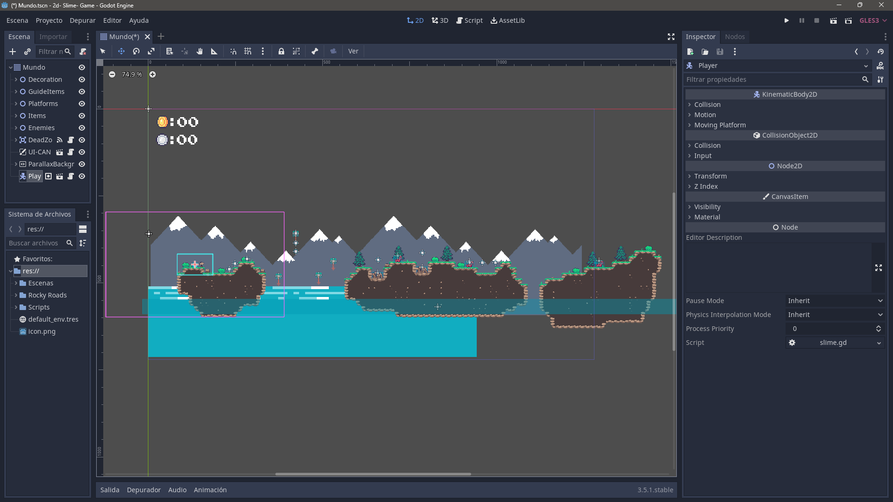
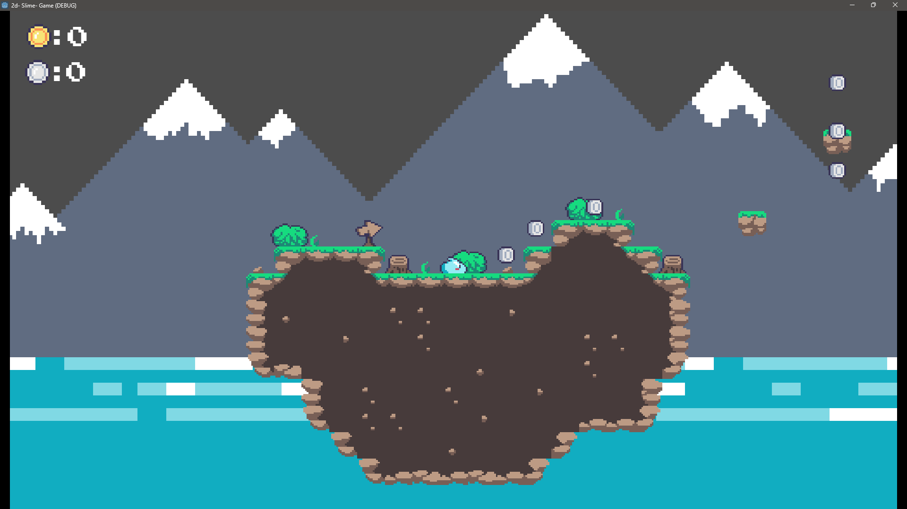
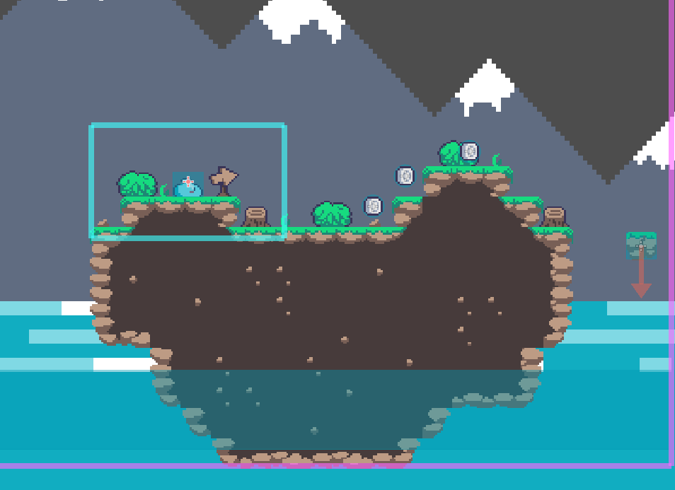
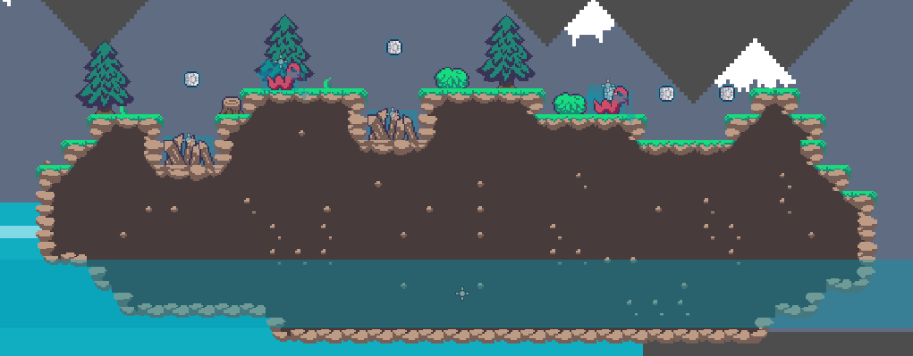
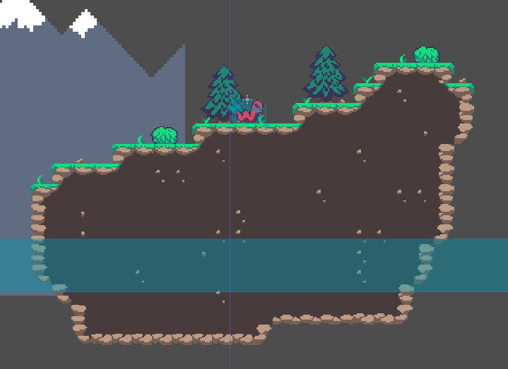

# Platform Slime2D-Game 

Este proyecto fue creado con el objetivo de entender cómo funciona Godot Engine y, al mismo tiempo, trabajar y enseñar a los niños en las escuelas cómo utilizarlo
# Resultado final
</img>

## Capturas de pantalla

## Créditos

Gracias a los siguientes canales de Youtube, pude completar el proyecto:

- [Albert valo](https://www.youtube.com/@AlbertValo)

- [JosueDev](https://www.youtube.com/@josuec)

- [LuisCanary](https://www.youtube.com/@LuisCanary)

## Licencia

[MIT](./LICENCE)